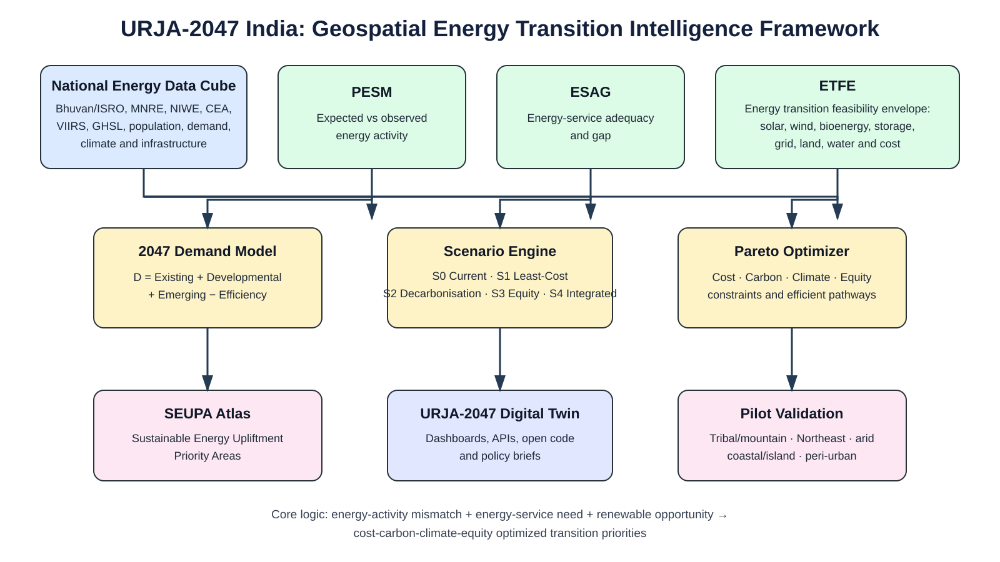

# URJA-2047 India

## Geospatial Energy Transition Intelligence Framework

**Primary thematic area:** Energy, Sustainability and Climate Change  
**Programme horizon:** Viksit Bharat 2047  
**Status:** PMRC proposal + national proof of concept

URJA-2047 India is a national geospatial research framework for supporting a **sustainable, equitable and climate-resilient energy transition**. It addresses India's dual challenge of reducing fossil-fuel and import vulnerability in high-demand regions while enabling sustainable energy upliftment in underserved, tribal, mountain, remote, arid, coastal, island and peri-urban regions without creating new fossil lock-in.

## Core research logic

**USE → NEED → OPPORTUNITY → PATHWAY**

Cross-cutting decision dimensions: **COST | CARBON | CLIMATE | EQUITY**

The framework integrates:

- **PESM — Preliminary Energy-Activity Mismatch:** expected versus observed energy/activity signal.
- **ESAG — Energy-Service Adequacy Gap:** expected energy service minus available energy service.
- **ETFE — Energy Transition Feasibility Envelope:** renewable, storage, grid, land, water and cost constraints.
- **SEUPA — Sustainable Energy Upliftment Priority Areas:** places where developmental energy need, vulnerability and sustainable-energy opportunity converge.
- **2047 Demand Model:** `D_2047 = D_Existing + D_Development + D_Emerging - D_Efficiency`.
- **Scenario Engine:** S0 Current, S1 Least-Cost, S2 Maximum Decarbonisation, S3 Equity First, S4 Integrated Viksit Bharat 2047.
- **URJA-2047 Digital Twin:** interactive geospatial decision-support environment for scenario testing, policy analysis and evidence communication.

## Preliminary proof of concept

A national 1-km PESM v02 structural CatBoost model has been completed as preliminary evidence. It was spatially validated using 100-km grouped folds and achieved an out-of-fold R² of **0.6165**. The final national analytical raster contains **2,280,332 valid 1-km cells**; **15.83%** have standardized PESM ≥ 1 RMSE and **7.67%** have PESM ≥ 2 RMSE. These are screening signals only and must not be interpreted directly as energy poverty or deprivation.

Preliminary national solar, wind and solar-wind complementarity layers have also been generated to demonstrate the renewable-opportunity side of the framework.

### Key evidence

- [PMRC proposal overview](proposal/PMRC/proposal_overview.md)
- [Analytical framework](docs/methodology/analytical_framework.md)
- [Authoritative data-source plan](docs/data_sources/authoritative_data_sources.md)
- [Preliminary results](docs/preliminary_results.md)
- [Final PESM screening summary](results/pesm/urja2047_india_pesm_v02_FINAL_screening_summary.csv)
- [Final PESM metadata](results/pesm/urja2047_india_pesm_v02_FINAL_metadata.json)
- [Spatial cross-validation comparison](models/validation/urja2047_pesm_v02_spatial_cv_summary.csv)
- [Operational-model feature importance](models/pesm_v02/urja2047_pesm_v02_structural_feature_importance.csv)
- [Wind screening metadata](results/renewable_resources/urja2047_wind_metadata_v01.csv)
- [Solar-wind complementarity metadata](results/renewable_resources/urja2047_solar_wind_complementarity_metadata_v01.csv)

## Repository structure

- `proposal/` — PMRC proposal and supporting documents.
- `docs/` — conceptual framework, methodology, data sources, policy context and references.
- `figures/` — framework, PESM, renewable-energy and multipanel figures.
- `data/` — metadata, small processed tables and data documentation; large rasters are not stored in ordinary Git history.
- `models/` — model definitions, validation summaries and explainability outputs.
- `notebooks/` — reproducible notebooks by analytical objective.
- `src/` — production scripts for Google Earth Engine, Python and R.
- `results/` — curated analytical outputs and summaries.
- `digital_twin/` — future dashboard, API and configuration components.
- `pilots/` — validation design for representative Indian landscapes.
- `policy/` — policy briefs, government evidence and scenario outputs.
- `reproducibility/` — environment definitions, manifests and workflow documentation.

## Data philosophy

The project prioritises Indian public-data infrastructure and authoritative sources including **Bhuvan/ISRO/NRSC, MNRE, NIWE, CEA, PPAC, Ministry of Power, NITI Aayog, MoSPI, Census of India, India-WRIS/CWC and IMD**, supplemented by globally consistent Earth-observation and climate datasets where scientifically appropriate. Third-party data remain subject to their original licences and terms of use.

Large national rasters are kept outside normal Git history and should be released through institutional storage, DOI repositories, Git LFS or release assets when licensing and hosting arrangements are finalised.

## Scientific caution

PESM is a **screening layer**, not a direct measure of electricity access, energy consumption or household energy poverty. Policy classification will require convergence with independent socioeconomic, service-adequacy, reliability and renewable-feasibility evidence.

## Citation

See `CITATION.cff` for the recommended project citation.
